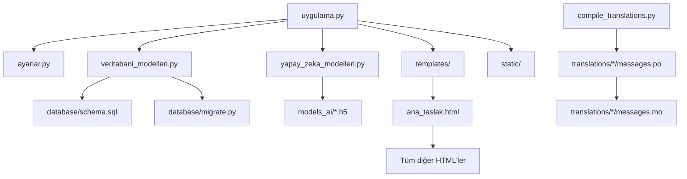

# TORISCAN - AI ile tıbbi görüntü analizi platformu - Zatürre, kemik kırığı ve göz hastalıklarının tespiti

## İçindekiler
1. [Proje Genel Bakış](#proje-genel-bakış)
2. [Teknoloji Altyapısı](#teknoloji-altyapısı)
3. [Proje Klasör Yapısı](#proje-klasör-yapısı)
4. [Veritabanı Mimarisi](#veritabani-mimarisi)
5. [Yapay Zeka Modelleri](#yapay-zeka-modelleri)
6. [Ana Uygulama (uygulama.py)](#ana-uygulama)
7. [Kullanıcı Arayüzü](#kullanıcı-arayüzü)
8. [Güvenlik Özellikleri](#güvenlik-özellikleri)
9. [Özellikler ve Yetenekler](#özellikler-ve-yetenekler)
10. [Kurulum ve Çalıştırma](#kurulum-ve-çalıştırma)

## Projenin Görüntüleri

### Ana Sayfa 
<p align="center">
  
  
</p>

### Kayıt Ol 
<p align="center">
  
</p>

### Giriş Yap 
<p align="center">
  
</p>

### Kullanıcı Paneli
<p align="center">
  
  
</p>

### Kullanici Ayarlari

<p align="center">
    
</p>

### Tek Görüntü Yükleme & Analiz Sonucu
<p align="center">
  
  
</p>

### PDF Yazdirma 
<p align="center">
  
  
</p>

### Toplu Yükleme
<p align="center">
  
  
</p>


### Admin Kontrol Paneli Detay
<p align="center">

  
  
</p>


## Proje Genel Bakış

**TORISCAN**, tıbbi görüntülerin (X-ray, retina taraması) yapay zeka ile analiz edildiği, kullanıcı dostu arayüze sahip, çok dilli web tabanlı bir **sağlık teknolojileri platformudur**.

### Temel Amaç
Hekimlerin, radyologların veya sağlık profesyonellerinin:
- **Kemik kırıklarını** tespit etmesine
- **Göz hastalıklarını** (Diyabetik Retinopati, Katarakt, Glokom) teşhis etmesine
- **Zatürre (Pneumonia)** tanısı koymasına

yapay zeka destekli sistemle yardımcı olmak.

### Proje Türü
- **Web Uygulaması** (Flask Framework)
- **Yapay Zeka Tabanlı Görüntü İşleme**
- **Çok Kullanıcılı Sistem**
- **Veritabanı Entegrasyonu** (SQL Server)


## Teknoloji Altyapısı

### Backend (Arka Plan)

| Teknoloji | Versiyon | Kullanım Amacı |
|-----------|---------|----------------|
| **Python** | 3.x | Ana programlama dili |
| **Flask** | 3.x | Web framework |
| **Flask-SQLAlchemy** | - | ORM (Veritabanı yönetimi) |
| **Flask-Babel** | - | Çok dilli destek |
| **TensorFlow/Keras** | 2.x | AI model yükleme ve tahmin |
| **Werkzeug** | - | Şifre hashleme, dosya güvenliği |
| **pyodbc** | - | SQL Server bağlantısı |

### Frontend (Ön Yüz)

| Teknoloji | Kullanım Amacı |
|-----------|----------------|
| **HTML5** | Sayfa yapısı |
| **CSS3 / Bootstrap 5** | Stil ve responsive tasarım |
| **JavaScript (Vanilla)** | İnteraktif özellikler |
| **Jinja2 Templates** | Dinamik sayfa oluşturma |

### Veritabanı

- **Microsoft SQL Server (MSSQL)**
  - Kullanıcı bilgileri
  - Analiz kayıtları
  - Batch (toplu) analiz kayıtları

### AI Modelleri

- **TensorFlow/Keras** ile eğitilmiş `.h5` formatında deep learning modelleri
- **Convolutional Neural Networks (CNN)** mimarisi

---

## Proje Klasör Yapısı ve Dosya Açıklamaları

### Proje Ağaç Yapısı

![Proje Klasör Yapısı]

```
TORISCAN/                     # Ana proje klasörü
│
├── 📁 .vscode/                        # Visual Studio Code ayarları
│   └── launch.json                   # Debug konfigürasyonu
│
├── 📁 __pycache__/                    # Python bytecode cache (otomatik)
│
├── 📁 database/                       # Veritabanı script'leri
│   ├── migrate.py                    # Veritabanı migration (şema güncelleme)
│   ├── schema.sql                    # Tam veritabanı şeması (tüm tablolar)

│
├── 📁 models_ai/                      # Yapay zeka modelleri
│   ├── kemik_modeli.h5               # Kemik kırığı CNN modeli (19 MB)
│   ├── goz_modeli.h5                 # Göz hastalığı CNN modeli (8 MB)
│   ├── zaturre_modeli.h5             # Zatürre CNN modeli (19 MB)
│   └── sinif_bilgileri.json          # Göz modeli sınıf isimleri
│
├── 📁 static/                         # Statik dosyalar (CSS, JS, images)
│   ├── 📁 css/
│   │   └── style.css                 # Ana stil dosyası (26 KB)
│   ├── 📁 js/
│   │   └── main.js                   # Ana JavaScript dosyası (10 KB)
│   ├── 📁 images/                    # Proje görselleri
│   └── 📁 uploads/                   # Kullanıcı yüklenen görüntüler
│
├── 📁 templates/                      # HTML şablonları 
│   ├── ana_taslak.html               # Master template (tüm sayfaların temeli)
│   ├── ana_sayfa.html                # Landing page (anasayfa)
│   ├── kayit_ol.html                 # Kullanıcı kayıt formu
│   ├── oturum_ac.html                # Giriş sayfası
│   ├── panel.html                    # Kullanıcı dashboard
│   ├── analiz_yap.html               # Tekli analiz sayfası
│   ├── batch_analiz.html             # Toplu analiz sayfası
│   ├── analiz_sonucu.html            # Tekli analiz sonucu
│   ├── batch_sonuc.html              # Toplu analiz sonuçları
│   ├── gecmis_kayitlar.html          # Geçmiş analizler listesi
│   ├── profilim.html                 # Kullanıcı profil sayfası
│   ├── sifre_degistir.html           # Şifre değiştirme
│   ├── admin_panel.html              # Admin kontrol paneli
│   ├── admin_kullanicilar.html       # Kullanıcı yönetimi (admin)
│   └── admin_analizler.html          # Analiz yönetimi (admin)
│
├── 📁 translations/                   # Çok dilli destek (i18n)
│   ├── 📁 tr/                        # Türkçe çeviriler
│   │   └── LC_MESSAGES/
│   │       ├── messages.po           # Türkçe çeviri dosyası (kaynak)
│   │       └── messages.mo           # Derlenmiş çeviri (binary)
│   └── 📁 en/                        # İngilizce çeviriler
│       └── LC_MESSAGES/
│           ├── messages.po           # İngilizce çeviri dosyası
│           └── messages.mo           # Derlenmiş çeviri
│
├── 📁 uploads/                        # Yüklenen görüntülerin saklandığı yer
│
├── 📄 ayarlar.py                      # Konfigürasyon dosyası (48 satır)
├── 📄 compile_translations.py         # Çeviri derleyici (78 satır)
├── 📄 uygulama.py                     # Ana Flask uygulaması (695 satır)
├── 📄 veritabani_modelleri.py         # SQLAlchemy modelleri (89 satır)
├── 📄 yapay_zeka_modelleri.py         # AI model manager (193 satır)

```

---

## Ana Python Dosyaları

### 1. `uygulama.py` (695 satır) **ANA KALP**

**Ne yapar:**
- Flask uygulamasının ana giriş noktası
- Tüm route'ları (URL yönlendirmelerini) tanımlar
- Kullanıcı kayıt, giriş, çıkış işlemlerini yönetir
- Analiz işlemlerini koordine eder
- Admin panelini çalıştırır

**Önemli Fonksiyonlar:**
```python
@app.route('/') - Ana sayfa
@app.route('/register') - Kayıt
@app.route('/login') - Giriş
@app.route('/analyze/<model_type>') - Tekli analiz
@app.route('/analyze/batch/<model_type>/process') - Toplu analiz
@app.route('/admin') - Admin paneli
```

**Başlatma:**
```bash
python uygulama.py
# Tarayıcı otomatik açılır: http://localhost:5000
```

### 2. `ayarlar.py` (48 satır)  **KONFİGÜRASYON**

**Ne yapar:**
- Tüm uygulama ayarlarını tek yerden yönetir
- Veritabanı bağlantı bilgileri
- Dosya yükleme limitleri
- Dil ayarları
- Güvenlik anahtarları

**İçerik:**
```python
class Config:
    # Güvenlik
    SECRET_KEY = 'dev-secret-key-change-in-production-2024'
    
    # Veritabanı
    DB_SERVER = 'localhost\\SQLEXPRESS02'
    DB_NAME = 'MedicalPlatform'
    DB_USERNAME = 'sa'
    DB_PASSWORD = '****'
    
    # Dosya yükleme
    MAX_FILE_SIZE = 16 * 1024 * 1024  # 16MB
    ALLOWED_EXTENSIONS = {'png', 'jpg', 'jpeg'}
    
    # Batch analiz
    MAX_BATCH_SIZE = 10  # Max 10 dosya
    
    # Diller
    BABEL_DEFAULT_LOCALE = 'tr'
    LANGUAGES = {'tr': 'Türkçe', 'en': 'English'}
```

### 3. `veritabani_modelleri.py`  **VERİTABANI MODELLERİ**

**Ne yapar:**
- SQLAlchemy ORM modellerini tanımlar
- 3 ana tablo: kullanıcı , analiz , toplu_analiz 
- Veritabanı ilişkilerini (Foreign Key) yönetir
- Şifre hashleme/doğrulama fonksiyonları

**Modeller:**

#### User (Kullanıcı)
```python
class User(db.Model):
    id = db.Column(db.Integer, primary_key=True)
    tc_kimlik = db.Column(db.String(11), unique=True)
    ad = db.Column(db.String(50))
    soyad = db.Column(db.String(50))
    telefon = db.Column(db.String(15))
    sifre_hash = db.Column(db.String(255))
    is_admin = db.Column(db.Boolean, default=False)
    
    # Fonksiyonlar
    def set_password(password):  # Şifre hashle
    def check_password(password):  # Şifre kontrol et
```

#### Analysis (Analiz)
```python
class Analysis(db.Model):
    id = db.Column(db.Integer, primary_key=True)
    kullanici_id = db.Column(db.Integer, ForeignKey)
    batch_id = db.Column(db.Integer, nullable=True)
    model_tipi = db.Column(db.String(20))  # bone/eye/lung
    gorsel_dosya_adi = db.Column(db.String(255))
    tani_sonucu = db.Column(db.String(100))
    guven_orani = db.Column(db.Float)
    sonuc_json = db.Column(db.Text)
```

#### BatchAnalysis (Toplu Analiz)
```python
class BatchAnalysis(db.Model):
    id = db.Column(db.Integer, primary_key=True)
    kullanici_id = db.Column(db.Integer, ForeignKey)
    model_tipi = db.Column(db.String(20))
    durum = db.Column(db.String(20))  
    toplam_dosya = db.Column(db.Integer)
    tamamlanan_dosya = db.Column(db.Integer)
```

### 4. `yapay_zeka_modelleri.py` (193 satır) **AI MANAGER**

**Ne yapar:**
- 3 AI modelini yükler ve yönetir
- Görüntü ön işleme (preprocessing)
- Model tahminlerini yapar
- Sonuçları formatlar

**Sınıf Yapısı:**
```python
class AIModelManager:
    def __init__(self):
        # Modelleri yükle
        self.models = {
            'bone': load_model('kemik_modeli.h5'),
            'eye': load_model('goz_modeli.h5'),
            'lung': load_model('zaturre_modeli.h5')
        }
    
    def preprocess_image(img_path):
        # 1. Görüntüyü aç
        # 2. RGB'ye çevir
        # 3. 64x64 resize
        # 4. Normalize (0-1)
        # 5. Batch boyutu ekle
    
    def predict_bone(img_path):
        # Kemik kırığı tahmini
    
    def predict_eye(img_path):
        # Göz hastalığı tahmini (4 sınıf)
    
    def predict_lung(img_path):
        # Zatürre tahmini
    
    def predict(model_type, img_path):
        # Genel tahmin fonksiyonu
```

### 5. `cevirileri_derle.py` (78 satır) **ÇEVİRİ DERLEYİCİ**

**Ne yapar:**
- `.po` (text) dosyalarını `.mo` (binary) formatına çevirir
- Flask-Babel'in kullanabileceği hale getirir
- TR ve EN dillerini derler

**Kullanım:**
```bash
python cevirileri_derle.py
# Çıktı:
# ✅ TR çevirisi derlendi!
# ✅ EN çevirisi derlendi!
```

**Nasıl çalışır:**
```
messages.po (metin) → compile_translations.py → messages.mo (binary)
                                                      ↓
                                                Flask-Babel kullanır
```

---

## Database Klasörü

### 1. `schema.sql` **VERİTABANI ŞEMASI**

**Ne yapar:**
- Sıfırdan veritabanı oluşturur
- `kullanicilar`, `analizler` ve `toplu_analizler` tablolarını yaratır
- Index'leri oluşturur
- `KullanicilarGizli` VIEW'ı oluşturur (şifreleri gizler)
- Admin yetkilendirme (`is_admin`) kolonlarını içerir

**Kullanım:**
```sql
-- SQL Server Management Studio'da çalıştır
```

**Oluşturduğu Tablolar:**
- `kullanicilar` - Kullanıcı bilgileri (Admin dahil)
- `analizler` - Analiz kayıtları (Batch ID dahil)
- `toplu_analizler` - Batch analiz kayıtları
- VIEW: `KullanicilarGizli` - Şifreler maskelenmiş

### 2. `migrate.py` (108 satır) **VERİTABANI MİGRATION**

**Ne yapar:**
- Mevcut veritabanını güncellemeden yeni özellikler ekler
- Admin özelliği (`is_admin` kolonu) ekler
- Batch analiz tablosu (`toplu_analizler`) ekler
- `batch_id` kolonunu `analizler` tablosuna ekler

**Kullanım:**
```bash
cd database
python migrate.py

# Çıktı:
# 1. User tablosu güncelleniyor...
#    ✓ is_admin kolonu eklendi
# 2. BatchAnalysis tablosu oluşturuluyor...
#    ✓ toplu_analizler tablosu oluşturuldu
# 3. Analysis tablosu güncelleniyor...
#    ✓ batch_id kolonu eklendi
# Veritabanı güncellemeleri tamamlandı!
```

**Migration Mantığı:**
```python
IF NOT EXISTS (kolon varsa):
    ALTER TABLE ADD kolon
ELSE:
    Zaten var, atla
```


## Models_AI Klasörü

### AI Model Dosyaları

| Dosya | Boyut | Model Tipi | Sınıf Sayısı | Açıklama |
|-------|-------|------------|--------------|----------|
| `kemik_modeli.h5` | 19.5 MB | Binary CNN | 2 | Kırık / Normal |
| `goz_modeli.h5` | 8.25 MB | Multi-class CNN | 4 | Normal/Diyabetik/Katarakt/Glokom |
| `zaturre_modeli.h5` | 19.5 MB | Binary CNN | 2 | Zatürre / Normal |

### `sinif_bilgileri.json`

**Ne yapar:**
- Göz modeli için sınıf isimlerini saklar

**İçerik:**
```json
{
  "Normal": 0,
  "diabetic_retinopathy": 1,
  "cataract": 2,
  "glaucoma": 3
}
```

**Neden var:**
- Model sadece sayı çıktısı verir (0, 1, 2, 3)
- Bu dosya sayıları isimlere çevirir

---

## Templates Klasörü (HTML Şablonları)

### Temel Şablonlar

#### 1. `ana_taslak.html` (Master Template) 
**Ne yapar:**
- Tüm sayfaların **ana iskeletidir**
- Navbar, footer, flash mesajları içerir
- Bootstrap 5 ve FontAwesome yükler

**Yapısı:**
```html
<!DOCTYPE html>
<html>
<head>
    <title></title>
    <link rel="stylesheet" href="bootstrap.css">
    <link rel="stylesheet" href="style.css">
</head>
<body>
    <!-- Navbar -->
    <nav>...</nav>
    
    <!-- Flash Mesajları -->
    
        <div class="alert">{{ message }}</div>
    
    
    <!-- Sayfa İçeriği -->
    
    
    <!-- Footer -->
    <footer>Yasal Uyarı...</footer>
</body>
</html>
```

#### 2. `ana_sayfa.html` (Landing Page) 
**Ne yapar:**
- Projenin vitrin sayfası
- 3 model kartı gösterir
- Her kart için "Analiz Yap" ve "Toplu Analiz" butonları

**Kartlar:**
- 🦴 Kemik Kırığı Analizi
- 👁️ Göz Hastalığı Analizi
- 🫁 Zatürre Analizi

#### 3. `kayit_ol.html` (Register) 
**Form Alanları:**
- TC Kimlik (11 hane)
- Ad
- Soyad
- Telefon
- Şifre
- Şifre Tekrar

**Validasyon:**
- Client-side: HTML5 `required`, `pattern`
- Server-side: `uygulama.py` içinde

#### 4. `oturum_ac.html` (Login) 
**Form Alanları:**
- TC Kimlik
- Şifre

**Session Oluşturma:**
```python
session['user_id'] = user.id
session['user_name'] = f"{user.ad} {user.soyad}"
session['is_admin'] = user.is_admin
```

### Kullanıcı Sayfaları

#### 5. `panel.html` (Dashboard) 
**Ne gösterir:**
- Hoş geldiniz mesajı
- 3 model kartı (Tekli + Toplu analiz butonları)
- Son 5 analiz listesi

#### 6. `analiz_yap.html` (Single Analysis) 
**Özellikler:**
- Dosya seçimi (JPG, JPEG, PNG)
- Önizleme
- "Analiz Başlat" butonu

**İşlem Akışı:**
```
Dosya Seç → Önizle → Analiz Başlat → AI İşle → Sonuç Göster
```

#### 7. `toplu_analiz.html` (Batch Analysis) 
**Özellikler:**
- Multiple dosya seçimi (max 10)
- Dosya sayısı badge 
- Önizleme galerisi (thumbnail'lar)
- Her dosya için ❌ kaldırma butonu
- Progress bar

**JavaScript:**
```javascript
// Dosyaları tut
let selectedFiles = [];

// Dosya seçildiğinde
onFileSelect() {
    selectedFiles.push(files);
    updatePreview();
    updateBadge();  // "5 dosya seçildi"
}

// Form gönder (AJAX)
onSubmit() {
    const formData = new FormData();
    selectedFiles.forEach(f => formData.append('batch_files', f));
    
    fetch('/analyze/batch/lung/process', {
        method: 'POST',
        body: formData
    });
}
```

#### 8. `analiz_sonucu.html` (Result) 
**Ne gösterir:**
- Yüklenen görüntü
- Tanı sonucu (renk kodlu)
  - 🟢 Yeşil: Sağlıklı
  - 🔴 Kırmızı: Hastalık
- Güven oranı (progress bar)
- Tarih/saat (Türkiye saati)
- Model bilgisi
- Detaylı JSON sonucu (göz modeli için tüm olasılıklar)

**Yazdırma:**
```css
@media print {
    .no-print { display: none; }  /* Butonları gizle */
    .legal-warning { display: block; }  /* Uyarıyı göster */
}
```

#### 9. `toplu_sonuc.html` (Batch Results) 
**Ne gösterir:**
- Batch özeti (toplam/başarılı)
- Analiz kartları (grid)
- Her kart:
  - Thumbnail
  - Tanı
  - Güven oranı

#### 10. `gecmis_kayitlar.html` (History) 
**Ne gösterir:**
- Kullanıcının tüm analizleri
- Tarih sırasına göre (en yeni üstte)
- Filtreleme (model tipine göre)

#### 11. `profilim.html` (Profile) 
**İşlevler:**
- Profil bilgilerini göster/düzenle
- Şifre değiştir linki
- Hesap sil butonu

#### 12. `sifre_degistir.html` (Change Password) 
**Form:**
- Mevcut şifre
- Yeni şifre
- Yeni şifre tekrar

### Admin Sayfaları

#### 13. `admin_panel.html` (Admin Dashboard) 
**İstatistikler:**
- Toplam kullanıcı sayısı
- Toplam analiz sayısı
- Toplam batch sayısı
- Model bazında istatistikler
  - Kemik: X analiz
  - Göz: Y analiz
  - Zatürre: Z analiz

**Listeler:**
- Son 10 kullanıcı
- Son 10 analiz

#### 14. `admin_kullanicilar.html` (User Management) 
**Ne yapar:**
- Tüm kullanıcıları listeler
- Her kullanıcı için:
  - ID, TC, Ad Soyad, Telefon
  - Admin mi?
  - Kayıt tarihi
  - [Sil] butonu (kendi hariç)

#### 15. `admin_analizler.html` (Analysis Management) 
**Ne yapar:**
- Tüm analizleri listeler
- Filtreleme:
  - Model tipine göre
  - Kullanıcıya göre
  - Tarihe göre

---

## Static Klasörü

### CSS
#### `style.css` (26 KB)
**Ne içerir:**
- Gradient arkaplanlar
- Kart stilleri
- Button animasyonları
- Responsive media query'ler
- Print stilleri

**Özel Sınıflar:**
```css
.gradient-bg { background: linear-gradient(...); }
.model-card { ... }
.badge-success { ... }
@media print { ... }
```

### JS
#### `main.js` (10 KB)
**Ne içerir:**
- Form validasyonları
- AJAX istekleri
- Dosya önizleme
- Progress bar animasyonları
- Dinamik badge güncellemeleri

**Fonksiyonlar:**
```javascript
function previewImage(file) { ... }
function validateForm() { ... }
function updateProgressBar(percentage) { ... }
function showAlert(message, type) { ... }
```

### Images
- Logo dosyası
- Placeholder görseller
- Icon'lar

### Uploads
**Ne için:**
- Kullanıcıların yüklediği X-ray, retina görüntüleri saklanır

**Dosya Adı Formatı:**
```
{user_id}_{model_type}_{timestamp}_{original_name}
Örnek: 5_lung_20260125_143010_xray.jpg
```

---

## Translations Klasörü

### Klasör Yapısı
```
translations/
├── tr/
│   └── LC_MESSAGES/
│       ├── messages.po  (Kaynak)
│       └── messages.mo  (Derlenmiş)
└── en/
    └── LC_MESSAGES/
        ├── messages.po
        └── messages.mo
```

### `messages.po` (Portable Object)
**Format:**
```po
msgid "Giriş Yap"
msgstr "Login"

msgid "Analiz Başlat"
msgstr "Start Analysis"
```

### `messages.mo` (Machine Object)
- Binary format
- Flask-Babel tarafından kullanılır
- `compile_translations.py` ile oluşturulur

---

## Diğer Klasörler

### `.vscode/`
**Ne için:**
- Visual Studio Code editör ayarları

#### `launch.json`
```json
{
  "configurations": [
    {
      "name": "Python: Flask",
      "type": "python",
      "request": "launch",
      "module": "flask",
      "env": {
        "FLASK_APP": "uygulama.py",
        "FLASK_DEBUG": "1"
      }
    }
  ]
}
```

### `__pycache__/`
- Python bytecode cache (otomatik oluşur)
- `.gitignore` ile ignore edilmeli

---

## Kök Dizindeki Dosyalar

### `requirements.txt`
**İçerik:**
```txt
Flask==3.0.0
Flask-SQLAlchemy
Flask-Babel
tensorflow
pillow
pyodbc
werkzeug
```

**Kullanım:**
```bash
pip install -r requirements.txt
```


---

## Dosya İlişkileri



---

## Veritabanı Mimarisi

### Tablo 1: `kullanicilar` (User)

Kullanıcı bilgilerini saklayan ana tablo.

| Sütun Adı | Veri Tipi | Açıklama |
|-----------|-----------|----------|
| `id` | Integer (PK) | Benzersiz kullanıcı ID |
| `tc_kimlik` | String(11) | TC Kimlik No (Unique) |
| `ad` | String(50) | Kullanıcı adı |
| `soyad` | String(50) | Kullanıcı soyadı |
| `telefon` | String(15) | Telefon numarası |
| `sifre_hash` | String(255) | Hashlenmiş şifre |
| `is_admin` | Boolean | Admin yetkisi (True/False) |
| `olusturma_tarihi` | DateTime | Kayıt tarihi (UTC) |

**Özellikler:**
- TC Kimlik üzerinde UNIQUE constraint
- Şifreler bcrypt ile hashlenmiş
- Admin/Normal kullanıcı ayrımı

### Tablo 2: `analizler` (Analysis)

Her bir tekil analiz kaydı.

| Sütun Adı | Veri Tipi | Açıklama |
|-----------|-----------|----------|
| `id` | Integer (PK) | Benzersiz analiz ID |
| `kullanici_id` | Integer (FK) | Kullanıcı ID (Foreign Key) |
| `batch_id` | Integer (FK) | Batch ID (varsa) |
| `model_tipi` | String(20) | Model tipi (bone/eye/lung) |
| `gorsel_dosya_adi` | String(255) | Yüklenen dosya adı |
| `tani_sonucu` | String(100) | Tanı sonucu (ör: "Zatürre") |
| `guven_orani` | Float | AI güven oranı (%) |
| `sonuc_json` | Text | Detaylı sonuç (JSON) |
| `olusturma_tarihi` | DateTime | İşlem tarihi |

**İlişkiler:**
- `kullanici_id` → `kullanicilar.id` (N:1)
- `batch_id` → `toplu_analizler.id` (N:1)

### Tablo 3: `toplu_analizler` (BatchAnalysis)

Toplu (batch) analiz işlemlerinin yönetimi.

| Sütun Adı | Veri Tipi | Açıklama |
|-----------|-----------|----------|
| `id` | Integer (PK) | Benzersiz batch ID |
| `kullanici_id` | Integer (FK) | Kullanıcı ID |
| `model_tipi` | String(20) | Model tipi |
| `durum` | String(20) | İşlem durumu (processing/completed/failed) |
| `toplam_dosya` | Integer | Toplam dosya sayısı |
| `tamamlanan_dosya` | Integer | Tamamlanan dosya sayısı |
| `olusturma_tarihi` | DateTime | İşlem tarihi |

**İlişkiler:**
- `kullanici_id` → `kullanicilar.id` (N:1)
- `analizler` → Her batch'e ait N adet analiz


⚠️ UYARI: Bu uygulama yalnızca eğitim ve proje geliştirme amaçlıdır. Sunulan bilgiler tıbbi tavsiye niteliği taşımaz. Sağlık sorunlarınız için lütfen en kısa sürede bir sağlık kuruluşuna veya uzman doktora danışınız.
